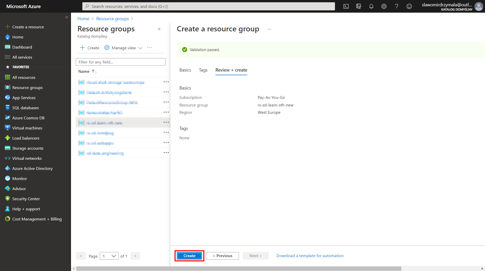

# Create resource group

In this section we will create a resource group that will group all of ours resources for the entire project

* On Azure Portal click on the "Resource groups" on the menu visible on the left hand side

* Click on "Create" to open the form to create a new resource group

* Provide the necesary information in the form

   * 1 - select the subscription that you want to use for the particular resource group
   * 2 - provide a name for your resource group
   * 3 - select region, for Poland and central Europe countires the "West Europe" should be just fine
   * 4 - click on "Review + create"   
   The tags can be used to describe and tag better the resource you are trying to create. It's completely unnecesaty for our purposes, but later on there miht be a policy in your company that will enforce you to create the given tags.

* Onced the validation is complete and not showing any error click "Create" to confirm the creation.

* After a few seconds or more the resoruce group will be craeted. The popup messagebox should inform about the completition, but it can be review anytime clicking the "Notifications" button.

* That's it. The resource group is created and ready to use.

# Additional resources
* [What is Azure Resource Manager?](https://docs.microsoft.com/en-us/azure/azure-resource-manager/management/overview)
* [Manage Azure Resource Manager resource groups by using the Azure portal](https://docs.microsoft.com/en-us/azure/azure-resource-manager/management/manage-resource-groups-portal)
