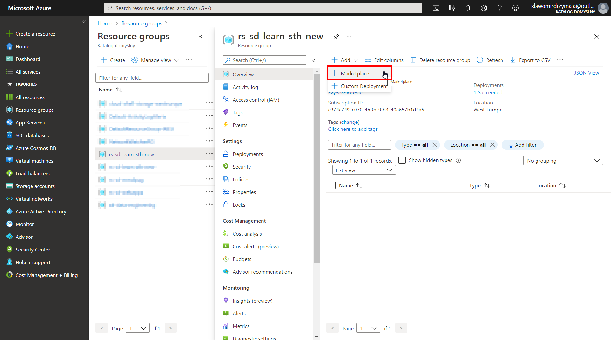
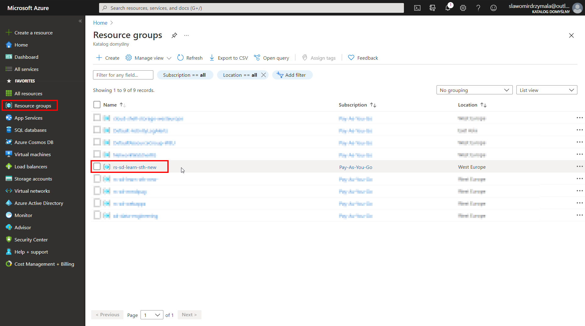
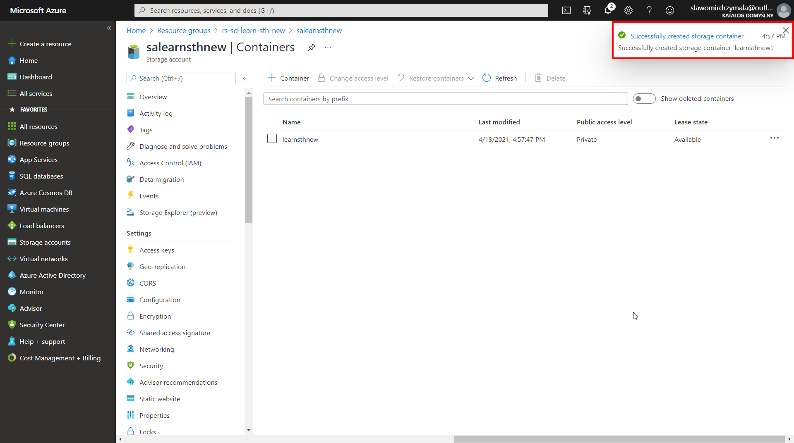

# Create Azure Data Lake
In this section we will create Azure Storage Account that will be used as a Data Lake.

* Select a resource group where you want to create the Azure Storage Account

   * 1 - Click on the "Resource groups" on the left hand side menu to see all resource groups
   * 2 - Click on the selected resource group to see it's content

* Click on "Add" > "Marketplace" to add a new resource to the resource group

* Select "Storage account" to create a new storage account

* Configure storage account (Basics)

   * 1 - select subscription
   * 2 - select the resource group (should be already pre-selected if you start from the particular resource group)
   * 3 - provide a name for new storage account
   * 4 - select location, preferably the same location as the resource group
   * 5 - select "Standard" for performance
   * 6 - select "StorageV2 (general purpose v2)" for account kind
   * 7 - select "Locally-redundant storage (LRS)" for replciation which for the test purposes should be just enough, for real project in most cases other options will be better
   * 8 - click "Next: Networking" to go to the next section

* Configure storage account (Networking)
At this point we will use the default settings and click "Next: Data protection"

* Configure storage account (Data protection)
At this point we will use the default settings again so click "Next: Advanced"

* Configure storage account (Advanced)
In the "Advance" section we need to change only one setting. We are going to enable the "Hierarchical namespace" which will make the storage account to be a "Data Lake Storage Gen2"

   * 1 - set "Hierarchical namespaces" to "Enabled"
   * 2 - then we can skip the "Tags" and click "Review + create"

* Once validation is completed and there is no errors click "Create"

* After that the screen with deployment "Ovierview" will appear. It might take a few seconds or more, but after that you will see that the deployment is complete. You can also switch to the other screen while the deployment is running. 

* That's it. The storage account is created and ready to use.

# Test the created storage account

* To test and get the first impresion about the storage account let's create some basic structure and upload some test files.

* Go to the "Resource groups" on the left hand side menu and then click and select the resource group where the storage account has been created

* Click and select the storage account that you have created

* Once inside the storage account click on "Containers"

* Then let's craete a new container that will play a role of a data lake for our project

   * 1 - Click "New container"
   * 2 - Then provide a name for the container
   * 3 - And click "Create" to create that container

* Within a few seconds you should be notifed that the container has been created.

* Click on the container to open.

* Once inside the container let's first create a new directory

   * 1 - Click on "Add directory"
   * 1 - Provide a name for the directory
   * 1 - Click "Save" to create the directory

* Again, after a few seconds the new directory should be visible and the new notification should popup.

* Let's click on the folder name to open

* Last step will be to upload two test files to the given directory. The file was taken from [datahub.io](https://datahub.io/core/continent-codes) and then splited manually into three different files providing the same information as the original file. Each file contains a sub-list of countries with the two-digits ISO-code. File is avaliable in the repository, see the links here.
    * [countries_01.json](./files/003/countries_01.json)
    * [countries_02.json](./files/003/countries_02.json)
    * [countries_03.json](./files/003/countries_03.json)   

   To upload the files:
   * 1 - Click on "Upload"
   * 2 - Click on the directory icon
   * 3 - Select the three files containing country lists at once
   * 4 - Click "Open" to confirm the files selection
   * 5 - One the window will close click "Upload" to start uploading the files   
   
   
   
* After a few seconds the files will be upload to the particular directory

* We can then check the additional properties of uplaoded files or even view and edit it's content.

   * 1 - select single file
   * 2 - click on "Edit" to view content

* Thet's it. The container is created with the basic directory structure and we have uploaded some files.

# Additional resources
* [Introduction to Azure Data Lake Storage Gen2](https://docs.microsoft.com/en-us/azure/storage/blobs/data-lake-storage-introduction)
* [FAQs About Organizing a Data Lake](https://www.sqlchick.com/entries/2019/1/20/faqs-about-organizing-a-data-lake)
* [Building your Data Lake on Azure Data Lake Storage gen2](https://medium.com/microsoftazure/building-your-data-lake-on-adls-gen2-3f196fc6b430)

