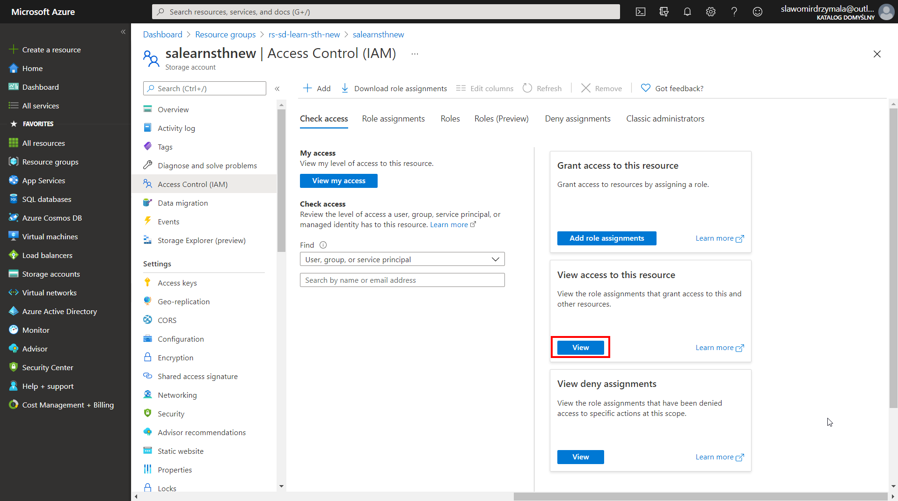
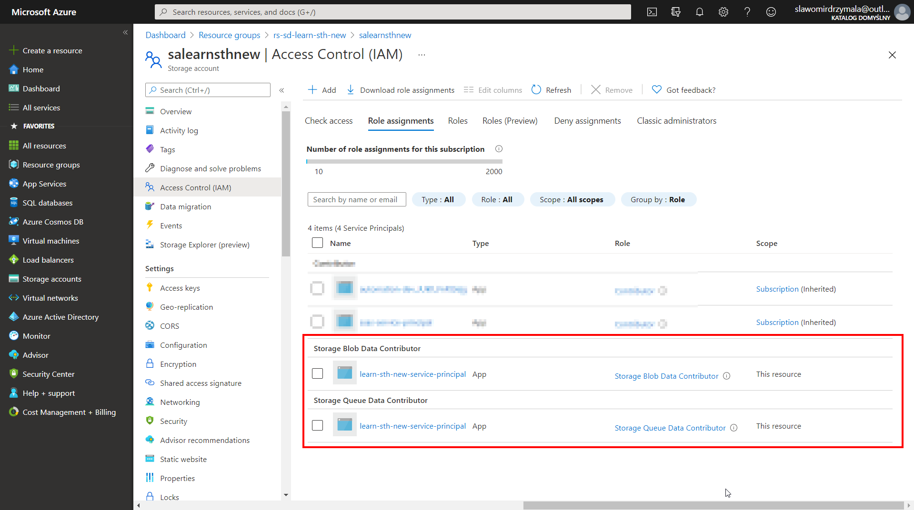

# Create service principal
In that section we will create a service principal. This will be a service account that will be used by other services to connect to the storage account.

* First of all let's go to the "App registrations" section where we can create the service principal.

   * 1 - Select "Azure Active Directory"
   * 2 - Select "App registrations"
   * 3 - Click "New registration" to add new service principal

* Then we will set up the service principal

   * 1 - specify the service principal name
   * 2 - select proper account type. If you are going to, apart from services or products in your Azure tenant, also use some services or products outside of Azure you might want to select "Accounts in any organizational directory (Any Azure AD directory - Multitenant) and personal Microsoft accounts (e.g. Skype, XBox)". If you are going to use only the services inside your Azure tenant than select the first option. 
   * 3 - click "Register" to confirm and register the service principal

* After a few seconds the service principal (app registration) will be created and visible on the list. Let's click on the name to view the details and continue configuration

* Now, we will already copy the information that we will need when we will want to use that service principal and also we will create a secret key to be able to authenticate. We want test the service principal right away, but we will for sure need that information soon.

   * 1 - copy to password manager the application ID and save
   * 2 - copy to password manager the tenant ID and save
   * 3 - click on "Certificates & secrets" to go to another form

* We need to create then a secret key that will be used to authenticate when using the service principal.

   * 1 - Click "New client secret"
   * 2 - Provide any description
   * 3 - Specify when the key will expire. Select "Recommended: 6 months"
   * 4 - Confirm using the "Add" button

* Once the secret key will be created copy the "Value" of secret key and store in the password manager for later use.

* The service principal is created so we need to grant to service principal the permission to use the storage account. First of all let's go to the storage account.

   * 1 - Click "Resource groups"
   * 2 - Select given resource group
   * 3 - Select given storage account

* We are going to add role permissions to service principal

   * 1 - Click "Access Control (IAM)"
   * 2 - Click "Add role assigments"

* The first permission to add will be "Storage Blob Data Contributor"

   * 1 - Select "Storage Blob Data Contributor"
   * 2 - Select "User, group, service principal"
   * 3 - Provide a partial name of the service principal name that was created before to find a proper service principal and them click the name to select one
   * 4 - After the given service principal will be selected it will apear on the bottom of the form
   * 5 - Click "Save" to confirm and add permission

* The second permission to add will be "Storage Queue Data Contributor". We need to repeat the same steps once more again.

   * 1 - Select "Storage Queue Data Contributor"
   * 2 - Select "User, group, service principal"
   * 3 - Provide a partial name of the service principal name that was created before to find a proper service principal and them click the name to select one
   * 4 - After the given service principal will be selected it will apear on the bottom of the form
   * 5 - Click "Save" to confirm and add permission

* To check if the permissions were added correctly we can click on the "View" button in the "View access to this resource"

* In the "View" form we should them see the two previously created permissions. Please note that you can also see the permissions that were granted on the higher level (reousrce group or subscription) as well.

# Additional resources
* [Application and service principal objects in Azure Active Directory](https://docs.microsoft.com/en-us/azure/active-directory/develop/app-objects-and-service-principals)
* [Acquire a token from Azure AD for authorizing requests from a client application](https://docs.microsoft.com/en-us/azure/storage/common/storage-auth-aad-app?tabs=dotnet)
