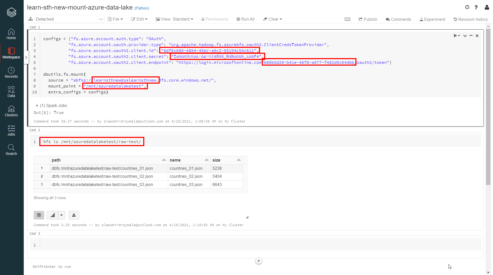

# Mount Azure Data Lake Storage to Databricks
In this section we will mount Azure Data Lake Storage Gen2 into the Databricks mount.

* Create new or use existing workbook and paste the below code and provide the needed secrets as below

The code to be added to the first cell to create the configuration of the mount and the mount itself. The below code is in Python. After the code is provided and configured run the cell to execute.
```
configs = {"fs.azure.account.auth.type": "OAuth",
          "fs.azure.account.oauth.provider.type": "org.apache.hadoop.fs.azurebfs.oauth2.ClientCredsTokenProvider",
          "fs.azure.account.oauth2.client.id": "<service-principal-client-id>",
          "fs.azure.account.oauth2.client.secret": "<service-principal-secret-key>",
          "fs.azure.account.oauth2.client.endpoint": "https://login.microsoftonline.com/<azure-ad-tenant-id>/oauth2/token"}

dbutils.fs.mount(
  source = "abfss://<container-name>@<storage-account-name>.dfs.core.windows.net/",
  mount_point = "/mnt/<mount-name>",
  extra_configs = configs)
```

* Please note that we shouldn't store the secrets in the workbook directly and the better idea would be to use the Databricks secrets. There is another section that describes the same with usage of Databricks secrets.

* The second cell can test if the mount is configured correctly. If so, if you will run the below query you should see the files that are uploaded to the particular directory in the particuar container in the particular storage account. The below code uses the Databricks magic command.

```
%fs ls /mnt/azuredatalaketest/raw-test/
```
or 
```
Display(dbutils.fs.ls("/mnt/azuredatalaketest/raw-test/"))
```

# Additional resources
* [Access Azure Data Lake Storage Gen2 using OAuth 2.0 with an Azure service principal](https://docs.databricks.com/data/data-sources/azure/adls-gen2/azure-datalake-gen2-sp-access.html)
